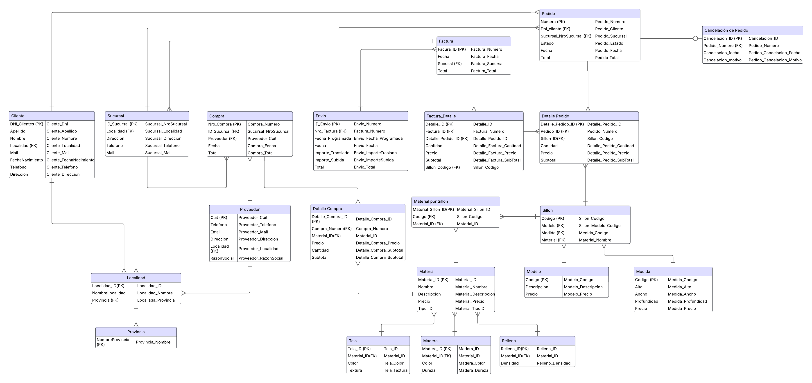
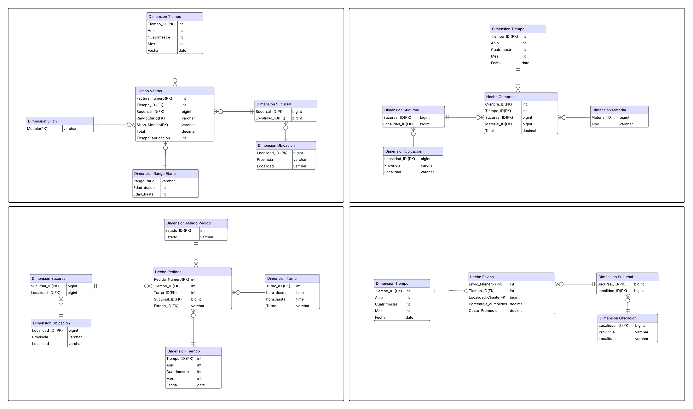

# Base de Datos — Fábrica de Sillones

**Trabajo Práctico — Gestión de Datos 1C2025**  
**Grupo:** BDGRUPO 35 | **Base de datos:** `GD1C2025`

---

## Integrantes
- Emanuel Santoro 
- Fausto Chattas
- Juliana Petito 
- Franco Tenaglia 

---

## Descripción del Proyecto

Este trabajo práctico modela y gestiona la base de datos de una **fábrica de sillones** que opera a través de múltiples sucursales en todo el país. El sistema abarca el ciclo completo del negocio: desde la compra de materiales a proveedores, la configuración de sillones personalizados, la gestión de pedidos y clientes, la facturación, hasta el seguimiento de envíos.

El proyecto se desarrolló en dos etapas bien diferenciadas:

1. **Base de datos transaccional (OLTP):** diseño normalizado para el registro operativo del negocio.
2. **Base de datos analítica (OLAP/BI):** modelo dimensional en estrella para análisis y toma de decisiones.

---

## Base de Datos Transaccional — `BDGRUPO`

### Diseño

La base de datos transaccional fue diseñada a partir de una tabla maestra desnormalizada (`gd_esquema.Maestra`) que concentraba toda la información del negocio. El proceso incluyó el análisis, normalización y migración de esos datos hacia un esquema relacional estructurado.

### Tablas

| Tabla | Descripción |
|---|---|
| `Provincia` | Provincias del país |
| `Localidad` | Localidades asociadas a una provincia |
| `Cliente` | Datos personales y de contacto del cliente |
| `Sucursal` | Sucursales de la fábrica (dirección, teléfono, mail) |
| `Proveedor` | Proveedores de materiales (CUIT, razón social, contacto) |
| `Material` | Materiales disponibles con tipo, precio y descripción |
| `Tela` | Especialización de material: color y textura |
| `Madera` | Especialización de material: color y dureza |
| `Relleno` | Especialización de material: densidad |
| `Modelo` | Modelos de sillones con código, descripción y precio base |
| `Medida` | Dimensiones posibles de sillones (alto, ancho, profundidad, precio) |
| `Sillon` | Combinación de modelo y medida que define un sillón concreto |
| `MaterialPorSillon` | Relación entre sillones y los materiales que los componen |
| `Compra` | Órdenes de compra de materiales por sucursal y proveedor |
| `DetalleCompra` | Ítems de cada compra con cantidad, precio y subtotal |
| `Pedido` | Pedidos realizados por clientes a una sucursal |
| `DetallePedido` | Sillones incluidos en cada pedido con cantidades y precios |
| `CancelacionPedido` | Registro de cancelaciones con fecha y motivo |
| `Factura` | Facturas emitidas por sucursal |
| `FacturaDetalle` | Detalle de los sillones facturados, vinculados al pedido |
| `Envio` | Envíos asociados a facturas con fechas e importes de traslado y subida |

### Diagrama ER



### Migración de Datos

Se implementó el procedimiento almacenado `BDGRUPO.Migrar_Datos` que extrae y transforma los datos desde la tabla maestra hacia las tablas normalizadas, respetando el orden de dependencias entre entidades (provincias → localidades → clientes/sucursales/proveedores → materiales → sillones → compras/pedidos → facturas → envíos).

---

## Base de Datos Analítica — `BDGRUPOBI`

### Diseño

Se diseñó un **modelo dimensional en estrella (Star Schema)** orientado al análisis del negocio, permitiendo consultas analíticas eficientes sobre ventas, compras, pedidos y envíos.

### Dimensiones

| Dimensión | Descripción |
|---|---|
| `DimTiempo` | Año, mes, cuatrimestre y fecha (2010–2030) |
| `DimUbicacion` | Localidad y provincia |
| `DimSucursal` | Sucursales con su ubicación |
| `DimMaterial` | Materiales clasificados por tipo |
| `DimSillon` | Modelos de sillones |
| `DimRangoEtario` | Segmentos de edad: <25, 25-35, 35-50, >50 |
| `DimTurno` | Turnos de atención: mañana (8-14 h) y tarde (14-20 h) |
| `DimEstadoPedido` | Estados posibles: pendiente, entregado, cancelado |

### Tablas de Hechos

| Hecho | Granularidad | Métricas |
|---|---|---|
| `HechoVentas` | Tiempo + Sucursal + Rango etario + Modelo | Total facturado, tiempo de fabricación promedio |
| `HechoCompras` | Tiempo + Sucursal + Material | Total comprado por tipo de material |
| `HechoPedidos` | Tiempo + Turno + Sucursal + Estado | Cantidad de pedidos, porcentaje de conversión |
| `HechoEnvios` | Tiempo + Localidad del cliente | Porcentaje de cumplimiento, costo promedio de envío |

### Diagrama ER — Modelo BI



---

## Vistas Analíticas

Se implementaron **10 vistas** sobre el modelo BI para responder preguntas clave del negocio:

| # | Vista | Descripción |
|---|---|---|
| 1 | `vista_ganancias` | Ganancia neta por sucursal y mes (ventas - compras) |
| 2 | `vista_factura_promedio_mensual` | Ticket promedio de factura por provincia y cuatrimestre |
| 3 | `vista_rendimiento_modelos` | Top 3 modelos más vendidos por localidad, cuatrimestre y rango etario |
| 4 | `vista_volumen_pedidos` | Cantidad de pedidos por turno, sucursal y mes |
| 5 | `vista_conversion_pedidos` | Tasa de conversión de pedidos por estado, sucursal y cuatrimestre |
| 6 | `vista_tiempo_promedio_fabricacion` | Tiempo promedio entre pedido y factura por sucursal y cuatrimestre |
| 7 | `vista_promedio_compras` | Importe promedio de compras por mes |
| 8 | `vista_compras_material` | Total comprado por tipo de material, sucursal y cuatrimestre |
| 9 | `vista_cumplimiento_envios` | Porcentaje de envíos realizados en tiempo por mes |
| 10 | `vista_localidades_mayor_costo` | Top 3 localidades con mayor costo promedio de envío |

---

## Estructura del Repositorio

```
BaseDeDatosTP2025/
├── Scripts_Creacion/
│   ├── script_creacion_inicial.sql   # Creación de tablas OLTP y migración de datos
│   └── script_creacion_Bl.sql        # Creación de tablas OLAP, carga de dimensiones/hechos y vistas
├── Diagramas/
│   ├── DER.jpg                        # Diagrama Entidad-Relación transaccional
│   └── DER_BI.jpg                     # Diagrama del modelo dimensional BI
├── Enunciados/
│   ├── Enunciado.pdf
│   ├── Apéndice del Enunciado - 1C2025.pdf
│   └── Registro de Cambios.pdf
├── Estrategia.pdf                     # Documento de estrategia y decisiones de diseño
├── Pruebas.SQL                        # Consultas de validación y verificación de datos
└── README.md
```

---

## Tecnología Utilizada

- **Motor de base de datos:** Microsoft SQL Server
- **Lenguaje:** T-SQL (Transact-SQL)
- **Paradigmas:** Modelo relacional (3FN) para OLTP + Modelo dimensional en estrella para OLAP

---

## Instrucciones de Ejecución

1. Asegurarse de tener acceso a la base de datos `GD1C2025` con la tabla `gd_esquema.Maestra` ya cargada.
2. Ejecutar `Scripts_Creacion/script_creacion_inicial.sql` para crear el esquema transaccional (`BDGRUPO`) y migrar los datos.
3. Ejecutar `Scripts_Creacion/script_creacion_Bl.sql` para crear el esquema analítico (`BDGRUPOBI`), cargar las dimensiones, las tablas de hechos y las vistas.
4. Opcionalmente, utilizar `Pruebas.SQL` para verificar la consistencia de los datos entre ambos esquemas.

> ⚠️ Los scripts incluyen sentencias `DROP` al inicio para limpiar ejecuciones previas. Ejecutar en el orden indicado.
